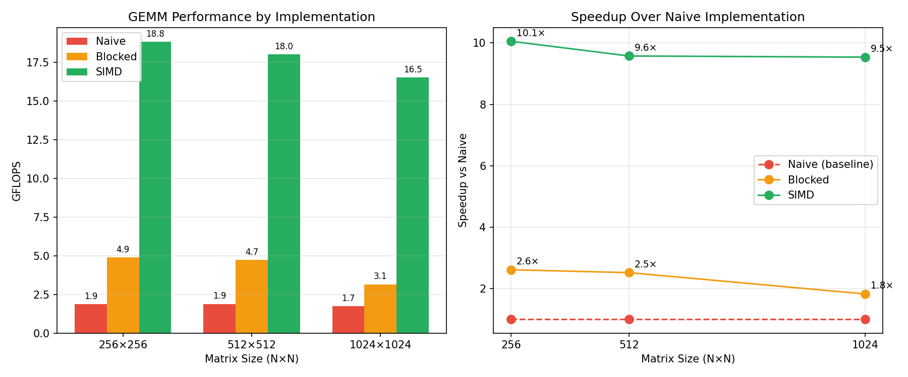

# Optimized CPU GEMM

**Platform:** Apple M2 MacBook Air
**Compiler:** Apple Clang with `-O3`
**Date:** December 2025

## Summary

Implemented three versions of General Matrix Multiply (GEMM):

1. **Naive** — Triple nested loop, baseline implementation
2. **Blocked** — Cache-blocked with 32×32 tiles, optimized loop order (i0→k0→j0)
3. **SIMD** — Blocked + ARM NEON vectorization (4 floats per instruction)

## Results

| Matrix Size | Naive (GFLOPS) | Blocked (GFLOPS) | SIMD (GFLOPS) | Speedup |
|-------------|----------------|------------------|---------------|---------|
| 256×256     | 1.87           | 4.88             | 18.8          | 10.1×   |
| 512×512     | 1.88           | 4.73             | 18.0          | 9.6×    |
| 1024×1024   | 1.73           | 3.15             | 16.5          | 9.5×    |



## Analysis

### Naive Implementation
- ~1.8 GFLOPS across all sizes
- Cache-hostile access pattern: B matrix accessed with stride N
- Each k iteration jumps N floats in memory, causing cache misses

### Blocked Implementation
- 2.6× speedup over naive (256×256)
- Performance degrades at 1024×1024 (3.15 GFLOPS) due to increased L2 pressure
- Loop reordering (k0 before j0) improved 1024×1024 by 14%

### SIMD Implementation
- 10× speedup over naive
- Processes 4 C elements per iteration using NEON `float32x4_t`
- Uses `vfmaq_f32` (fused multiply-add) for compute
- 74% of cycles spent in FMA instruction (compute-bound)

## Profiling

Profiled with `samply` (Firefox Profiler):

| Hotspot | % of Time | Notes |
|---------|-----------|-------|
| `vfmaq_f32` | 74% | Actual computation (ideal) |
| k loop overhead | 12% | Loop control/bounds checking |
| `vld1q_f32` (B load) | 7.5% | Memory access |
| i loop overhead | 4% | Loop control |
| `vst1q_f32` (C store) | 2% | Memory access |

## Theoretical Analysis

- M2 theoretical FP32 peak: ~110 GFLOPS (4 P-cores × 8 FLOPs/cycle × 3.5 GHz)
- Current achievement: 18 GFLOPS (~16% of peak)
- Apple Accelerate (BLAS): 60-80+ GFLOPS (~60% of peak)

## Key Learnings

1. **Cache blocking** provides 2-3× improvement by keeping working set in L1
2. **Loop ordering** matters — keeping A tile in cache while scanning B columns
3. **SIMD** provides ~4× throughput improvement (4 floats per instruction)
4. **FMA instructions** are key — single instruction for multiply-add
5. **Profiling** confirms compute-bound behavior (74% in FMA)

## Future Optimizations

To reach 30-50 GFLOPS:
- Register tiling (multiple C accumulators)
- Loop unrolling (reduce 12% loop overhead)
- Prefetching (hide memory latency)

These concepts transfer directly to GPU programming (shared memory tiling, warp-level parallelism).

## Build

```bash
mkdir build && cd build
cmake -DCMAKE_BUILD_TYPE=Release ..
make
./gemm_benchmark
```

## Regenerate Graphs

```bash
python3 plot_results.py
```
